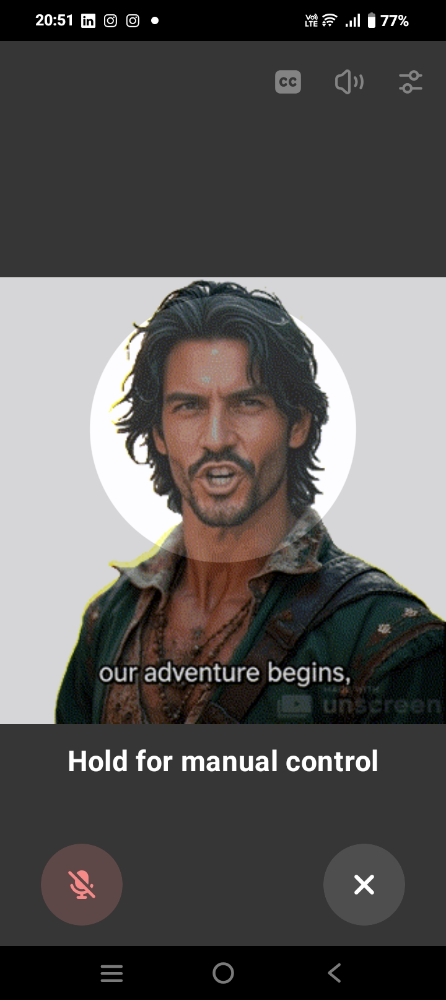

ChatGPT Avatar Overlay

An Android overlay app that displays an animated avatar during ChatGPT voice conversations.

Features

🎭 Automatically appears when ChatGPT voice mode is active

👆 Tap to start/stop lip-sync animation

🎯 Drag to reposition anywhere on screen

🔄 Double-tap to cycle through display modes

👻 Transparent background

## 🎬 Screenshot

*Voice Mode Communication with ChatGPT in real-time*
Installation

Clone this repository
Build: ./gradlew assembleDebug
Install the APK from app/build/outputs/apk/debug/
Grant overlay permission

Usage

Open ChatGPT voice mode

Avatar appears automatically

Tap to start/stop animation

Drag to move, double-tap to resize

Customization
Replace app/src/main/res/raw/avatar_lipsync.gif with your own animated GIF.

License

MIT

## 💫 Let's connect
- 💌 [Email](mailto:marisombra@proton.me)
- 🎮 [Twitch](https://www.twitch.tv/marissombra)    
- 🧵 [TikTok](https://www.tiktok.com/@marissombra)
- 🪩 [Itch.io](https://marisombra.itch.io/) (for games)
